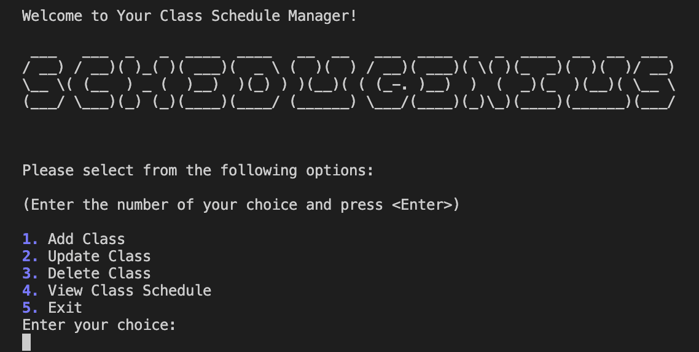

# ScheduGenius 

### [GitHub Repo](https://github.com/sooffia/T1A3_Terminal-Application/tree/main) 
### [Trello board](https://trello.com/b/pvjBsD7b/t1a3-terminal-application) 

## Purpose 
With ScheduGenius, a class scheduling organizer that allows users to construct highly customized and adaptable class schedules, users can easily manage their academic lives. By providing intuitive tools for adding, editing, removing classes, and accessing schedules, ScheduGenius allows users to manage their classes effectively. This project is intended to demonstrate my ability to work with a variety of development tools, with an emphasis on the Python programming language. Through this project, I seek to expand my capabilities in designing, implementing, and thoroughly testing an application by developing a terminal-based (command line) application.


## Target Audience
The target audience for the ScheduGenius terminal application includes both students and teachers. For students, ScheduGenius offers a convenient way to manage their class schedules, helping them stay organized and on track with their academic commitments. Teachers can also benefit from ScheduGenius by using it to manage their teaching schedules, track class timings, and organize classroom activities effectively. By catering to both students and teachers, ScheduGenius aims to streamline the scheduling process and enhance productivity in educational environments.

## Code Style 
The ScheduGenius terminal application was meticulously crafted using Python3, adhering to industry-standard conventions and guidelines such as the PEP 8 - Style Guide For Python Code by Guido van Rossum, Barry Warsaw, and Nick Coghlan. This includes maintaining a clean and organized code layout with four spaces of indentation, consistent use of tabs (though spaces are preferred), block comments for clarity, and whitespace management in expressions and statements.(1) 

A key focus was placed on using descriptive variable and function names, following the lowercase with underscores convention for readability and understanding. Docstrings were employed for all functions to provide comprehensive documentation within the codebase.

Only two global variables were employed to promote modularity and encapsulation, aligning with best practices for minimal global variable usage. Additionally, all imports are grouped at the top of the code for easy reference and management.
The application's functionality encompasses features such as adding, updating, deleting, and viewing class schedules. A key emphasis was placed on a user-centric design, with users being greeted with a welcoming message upon launching the program, setting a friendly tone for their interaction. The main menu offers clear options, guiding users through the various functionalities seamlessly.

Adding a class involves inputting details such as class name, day, start time, end time, and room number. The application validates inputs to prevent scheduling conflicts and provides feedback to ensure accurate data entry.
Updating classes allows users to modify existing class details, with the program guiding them through the process step by step. Similarly, deleting classes is streamlined, ensuring users can efficiently remove unwanted classes from their schedule.

Viewing the class schedule presents a comprehensive overview organized by days of the week, providing users with a clear snapshot of their classes and timings.
Overall, the Class Schedule Manager terminal application embodies a user-centric design, robust functionality, and unwavering adherence to industry standards, offering a seamless experience for managing class schedules effectively.

## Features 

### 1. Main Menu 
The main menu feature acts as the central control hub of the class scheduling terminal application, orchestrating user interactions and navigation through various functionalities. It utilises Python variables like options to list available actions and choice to capture user input, creating a dynamic and responsive interface. The implementation of loops and conditional structures ensures that user choices are validated, allowing only valid options to be processed. For instance, if a user enters an invalid choice or an unrecognized input, the program responds with an appropriate error message, guiding the user to correct their selection. This robust error handling mechanism contributes significantly to a smooth and user-friendly experience, showcasing Python's versatility in managing user interactions and controlling program flow effectively.

### 2. Add Class
The "Add Class Schedule" feature within the class scheduling terminal application enables users to seamlessly input new classes into their schedule. Upon selecting this option from the main menu, the program clears the screen and displays an add logo, creating a visually distinct interface to guide users. Users are then prompted to enter various details for the new class, such as the class name, day (e.g., Monday), start time (in HH:MM format), end time (in HH:MM format), and room number.

This feature demonstrates the effective use of variables and variable scope. Class_name, day, start_time_str, end_time_str, and room are utilised to store user inputs and manage data within the function's scope. Loops are employed to validate user inputs, ensuring that the entered day is valid (Monday to Sunday) and that the time inputs adhere to the correct format. Conditional control structures are used to handle exceptions, such as raising an InvalidTimeError if the end time is not later than the start time.

Furthermore, error-handling mechanisms are incorporated to provide a smooth user experience. For instance, an error message is displayed if a class overlaps with another class on the same day, preventing scheduling conflicts. If no overlaps are found, the class information is written to a CSV file, and a success message is shown, allowing users to add another class or return to the main menu for further actions.

### 3. Update Class
The "Update Class Schedule" feature empowers users to modify existing classes within their schedule with ease. It utilizes a set of variables, including class_name, day, start_time, end_time, and room, to manage the updating process. Python's loops are employed to guide users through updating class details, validating each input to ensure correctness and adherence to required formats. Error handling mechanisms are seamlessly integrated to handle unexpected scenarios, such as invalid inputs or selection of non-existent classes. Upon successful updates, the feature efficiently overwrites the relevant data in the CSV file, reflecting the changes made by the user. This functionality showcases Python's proficiency in data manipulation, user interaction, and error handling, providing users with a reliable and straightforward way to update their class schedules.

### 4. Delete Class
The "Delete Class Schedule" feature in the class scheduling terminal application empowers users to efficiently remove unwanted courses from their schedule. This feature prominently demonstrates the use of variables and variable scope, as various variables such as schedule, valid choices, and choice are utilised to manage data and user inputs within the function's scope. Loops and conditional control structures are also effectively employed to handle user inputs, validations, and deletion processes.

When users select the delete class option from the main menu, the program clears the screen and displays a delete logo, providing a visually distinct interface for users to navigate the deletion process smoothly. The current class schedule is loaded from the CSV file and presented to the user for reference. Users input the number of the class they want to delete, with input validation ensuring a valid class number is entered.

Error handling mechanisms are integrated into the feature to enhance user experience. For instance, if the user provides invalid inputs or selects an invalid class number, appropriate error messages are displayed to guide them through the correction process. Once a valid class is selected for deletion, it is removed from the schedule, and the CSV file is updated accordingly. A success message confirms the deletion, and users can delete another class or return to the main menu for further actions.

## Implementation Plan 
To adhere to the marking rubric's requirements for a well-organized implementation plan, I incorporated Trello as a pivotal tool in my development process. This integration allowed me to intricately monitor progress, categorize distinct features, and maintain a systematic task list. Each feature received a detailed breakdown of tasks, with deadlines strategically set approximately a week ahead of the actual due date. This proactive scheduling strategy provided a buffer for comprehensive testing, error handling, and addressing any unexpected hurdles encountered during development. Leveraging Trello's visual indicators, such as turning deadline boxes green upon task completion, fostered a sense of achievement and enhanced the overall project management efficiency.

Here is a link to my trello: 

Trello was essential in effectively organising the entire development process of my class schedule manager terminal application. Trello facilitated the whole software development process, from early planning to testing, development, and refining the codebase. It enabled agile modifications and enhancements throughout the process. An important lesson learned is the Trello board's ever-changing nature, as tasks were continuously added, updated, or completed. This flexibility and unintentional alignment with Agile approaches demonstrated the non-linear character of the development process.

Throughout the development journey, prioritization was given to fundamental features critical to the application's success. 
- Creating a comprehensive logic for managing class schedules, including adding
updating, and deleting classes.
- Implementing validation checks for inputs such as class names, days of the week, and time formats to ensure data integrity.Incorporating error handling mechanisms to address invalid inputs and overlapping class schedules.
- Designing an intuitive user interface with clear navigation options for seamless interaction.
- Utilising CSV file handling for efficient storage and retrieval of class schedule data.

Focusing on these core components improved the application's usability and functionality while simultaneously conforming to contemporary software development methodologies' flexible and iterative nature.

## Psuedocodes

### Feature 1 - Add Class Schedule (High Priority)

    Import CSV Module
    Define AddClassSchedule():
        Clear Screen
        Print Add Logo
        
        Loop Until User Stops:
            Prompt User to Enter Class Name
            Prompt User to Enter Day (e.g., Monday)
            Validate Day Input
            Prompt User to Enter Start Time (HH:MM)
            Validate Start Time Input
            Prompt User to Enter End Time (HH:MM)
            Validate End Time Input
            Prompt User to Enter Room Number
            Check for Class Overlaps
            If No Overlaps Found:
                Write Class Information to CSV
                Print Success Message
                Prompt User to Add Another Class or Return to Main Menu

### Feature 2 - Update Class Schedule (High Priority)

    Import CSV Module
    Define UpdateClassSchedule():
        Clear Screen
        Print Update Log
        Load Existing Schedule from CSV
        Display Current Class Schedule
        Prompt User to Select Class to Update
        Validate User Input
        Prompt User to Update Class Information
        Validate Updated Information
        Update CSV with New Class Information
        Print Success Message
        Prompt User to Update Another Class or Return to Main Menu

### Feature 3 - Delete Class Schedule (High Priority)

    Import CSV Module
    Define DeleteClassSchedule():
        Clear Screen
        Print Delete Logo
        Load Existing Schedule from CSV
        Display Current Class Schedule
        Prompt User to Select Class to Delete
        Validate User Input
        Delete Selected Class from CSV
        Print Success Message
        Prompt User to Delete Another Class or Return to Main Menu

### Feature 4 - View Class Schedule (High Priority)

    Import CSV Module
    Define ViewClassSchedule():
        Clear Screen
        Print View Logo
        Load Existing Schedule from CSV
        Display Current Class Schedule Grouped by Day
        Handle Exceptions (e.g., Invalid Schedule Format, File Not Found)
        Prompt User to Return to Main Menu

### Main Program

    Define MainProgram():
        Display Main Greeting
        Loop Until User Exits:
            Display Main Menu Options
            Prompt User for Choice
            If Choice == Add Class:
                Run AddClassSchedule()
            If Choice == Update Class:
                Run UpdateClassSchedule()
            If Choice == Delete Class:
                Run DeleteClassSchedule()
            If Choice == View Class Schedule:
                Run ViewClassSchedule()
            If Choice == Exit Program:
                Display Exit Message
                Terminate Application

If __name__ == "__main__":
    Run MainProgram()

## Installation Guide 

### System Requirements: 

This application is designed to run on MacOS systems using the Terminal application. If you are using Windows, consider using the Ubuntu terminal through Windows Subsystem for Linux (WSL).

Step 1: Open the Terminal
- First, open the Terminal application on your Mac. You can do this by searching for "Terminal" in Spotlight or navigating to Applications > Utilities > Terminal.

Step 2: Check Python Version
- To check if Python is installed on your computer and verify the version, type the following command in the Terminal and press Enter: 
```shell
python --version
```
If Python is not installed or you need to update it, you can download the latest version from the official Python website at python.org.

Please ensure that you have Python 3.11+ installed. 

### Installation Steps: 

1. Choose a folder where you want to save the terminal application. (Example, your desktop folder)
```shell
cd /Users/username/Desktop
``` 

2. Once inside the selected folder, clone the application repository from Github using the command: 
```shell 
git clone https://github.com/jordansbenjamin/Blackjack_terminal-app.git
```
This command will clone the repository from the following window on [Github Repo](https://github.com/sooffia/T1A3_Terminal-Application/tree/main) 

3. Navigate to the folder containing the cloned repository using the terminal. 
```shell
cd T1A3_Terminal-Application/src
```

4. Within the repository folder, type the following command and press Enter: 
```shell
./run_application.sh
``` 
This command will automatically execute the bash script contained in the folder, performing the following actions:
- Checks if Python version 3 is installed and displays a warning message if not available.
- Creates a virtual environment named .venv.
- Activates the virtual environment.
- Installs all application dependencies listed in the requirements.txt file.
- Runs the Python file.
- Deactivates the virtual environment after completing the application execution.

Note: If step 4 encounters issues, run the following command and then retry. 
```shell
chmod +x run_application.sh
``` 

### Operating System Requirements: 

ScheduGenius is compatible with Windows, Mac OS X, and Linux.
- Windows: Windows 7, 10, or 11
- Mac OS X: Version 10.11 or higher, 64-bit

The application has undergone development and testing on the following system:

- 2021 Retina XDR 16-inch Macbook Pro
    - Apple M1 Pro Chip
    - 16GB Unified Memory
    - 12GB SSD

### Dependencies

The ScheduGenius program requires the following dependencies, all of which are automatically installed into the virtual environment when you follow the steps above:
```txt
clear==2.0.0
colored==1.4.4
```

## References: 
